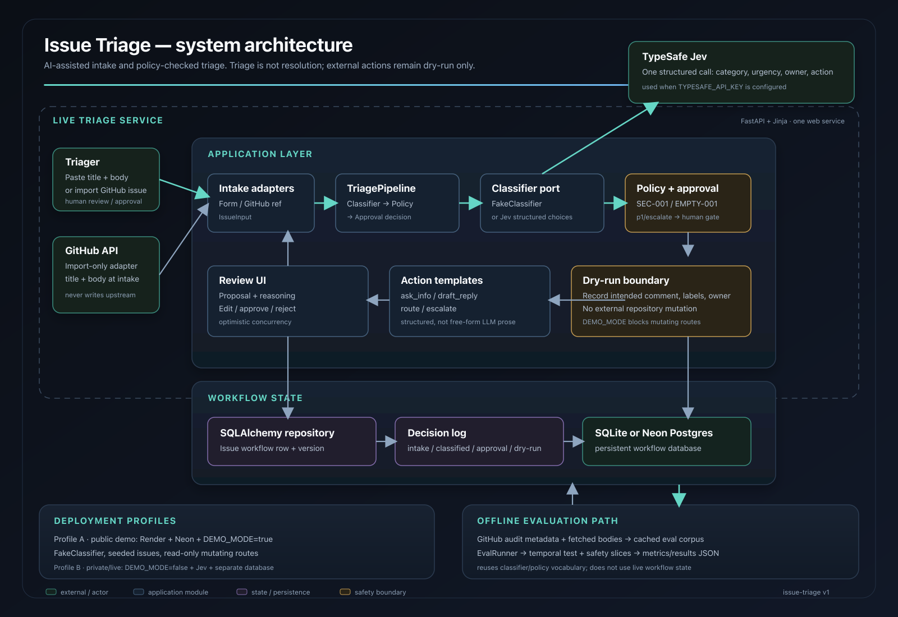

# Issue Triage

AI-assisted **Triage** (not Resolution) for messy GitHub Issues: one structured model proposal, deterministic policy overrides, human approval on high-impact paths, and dry-run actions only — never writes to elastic/kibana.

Built as an FDE portfolio proof. Evaluation replays filtered public Kibana Issues offline; the product identity is the workflow, not “a Kibana classifier.”

---

## Evaluation — headline metrics

Corpus: 5,447 Kibana issues with fetched bodies (99.9% non-empty). Eval replays title+body through the live pipeline offline.

**Security escalation set** (n=211, SEC-001 vuln-language in text): headline is **missed escalation rate**.

| Metric | Security escalation | Critical routing (n=351) | Test (n=1362) |
|--------|---------------------|--------------------------|---------------|
| **Missed escalation (combined)** | **0%** | — | — |
| False escalation rate | — | — | **1.2%** |
| Owner agreement | 94.8% | 67.5% | 68.7% |
| Urgency agreement | 7.6% | 4.3% | 46.3% |
| Human intervention rate | 100% | 98.3% | 85.3% |

Ablation (security escalation missed rate):

| System | Missed escalation | Notes |
|--------|-------------------|-------|
| **LLM + policy (combined)** | **0%** | Jev + SEC-001 + monotonic EMPTY-001 |
| Rules only | 0% | SEC-001 without LLM |
| Model only (Jev) | 97.2% | Policy layer required |
| TF-IDF baseline | 85.3% | No policy |
| Majority baseline | 100% | Always route |

Run eval with a body-complete corpus:

```bash
PYTHONPATH=src uv run python -m issue_triage.eval.run ingest --fetch-bodies --sleep-seconds 1
PYTHONPATH=src uv run python -m issue_triage.eval.run run --classifier jev
```

See [docs/eval/failure-diagnosis.md](docs/eval/failure-diagnosis.md) for methodology and failure-mode analysis.

Ground truth is **noisy**: maintainer labels are reference decisions. Security-language cases use a strict escalation contract; critical routing uses separate operational metrics.

---

## Six questions (FDE handout)

### 1. Customer — who is this for?

A **fictional** six-person open-source maintainer team (Kibana-shaped). See [docs/discovery-brief.md](docs/discovery-brief.md). Recruiters evaluating embedded-engineering skill are the real audience.

### 2. What was broken?

~100–150 Issues/week, inconsistent urgency and ownership, high-impact reports sitting in `needs-triage`, no structured audit trail. Triage is manual, boring, and error-prone on safety-sensitive language.

### 3. What we built

- **Intake:** paste form (title + body) or GitHub import by issue number/URL.
- **TriagePipeline:** one Classifier call → Policy rules → Approval policy → optional dry-run record.
- **Business actions:** `ask_info`, `draft_reply`, `route`, `escalate` (templates, not free-form LLM replies).
- **Review UI:** FastAPI + Jinja; approve/reject with optimistic concurrency.
- **Persistence:** SQLAlchemy workflow row + decision log (SQLite local, Neon Postgres in production).
- **Public demo:** `DEMO_MODE` + seeded Issues on first load.

### 4. How it works

```
Issue (title, body) → Classifier proposal → Policy (deterministic overrides)
  → Approval policy → [human checkpoint] → Dry-run action (DB only)
```

Policy runs **after** the model and can override urgency, owner, and action. Security rules match **vulnerability language** (e.g. password reset, auth bypass), not the bare word “security” (Elastic Security product noise).

## System architecture



The system is intentionally a small, interviewable Python application with two connected paths: a live triage workflow and a separate offline evaluation workflow.

### Live triage path

1. **Intake** — a Triager pastes an issue title and body, or imports a public GitHub issue by URL or `owner/repo#number`. GitHub is read-only and only title/body are passed into triage.
2. **Application layer** — FastAPI serves the inbox and review pages with Jinja templates. `TriagePipeline` is the central behavior seam.
3. **Classifier port** — the pipeline calls one structured classifier. Local and public-demo runs use the deterministic `FakeClassifier`; private live runs can select TypeSafe Jev through the same `Classifier` interface.
4. **Policy and approval** — Python policy rules run after classification. `SEC-001` forces escalation for vulnerability language, while `EMPTY-001` requests missing information without downgrading a high-stakes proposal. The approval policy requires a human checkpoint for `p1`, `escalate`, policy overrides, and low-confidence proposals; low-risk p3 paths may auto-proceed.
5. **Review and action** — the Triager can inspect reasoning, edit urgency/owner/action, approve, or reject. Approved work produces a deterministic template comment, labels, and owner assignment as a dry-run record only.
6. **Persistence and audit** — SQLAlchemy stores the workflow row, version, proposal, policy result, approval state, and dry-run output. An append-only decision log records intake, classification, approval/rejection, failures, and dry-run events. Optimistic concurrency prevents silent overwrites.

### Offline evaluation path

The evaluation path does not use live workflow state. It ingests a filtered historical Kibana corpus, fetches and caches issue bodies, validates corpus quality, and replays title/body-only inputs through the classifier and policy layers. `EvalRunner` compares the combined system with model-only, rules-only, majority, and TF-IDF baselines across security-escalation, critical-routing, and temporal test splits. Per-record traces preserve the proposal, policy rule, merged outcome, approval requirement, and metric result for failure review.

### Deployment and safety boundaries

- **Public demo:** Render + Neon with `DEMO_MODE=true`, seeded examples, `FakeClassifier`, and mutating routes disabled.
- **Private live profile:** `DEMO_MODE=false`, a separate database, optional GitHub import, and Jev selected by `TYPESAFE_API_KEY`.
- **No upstream writes:** the application never posts comments, changes labels, assigns owners, closes issues, or modifies `elastic/kibana`.
- **No background orchestration:** one FastAPI service and ordinary Python workflow code are the source of truth; there is no LangGraph, queue, cron job, or separate frontend service.

### 5. How we evaluate

- **Dual sets:** operational (natural mix, temporal split by `created_at`) + safety challenge (must-escalate cases).
- **Intake-safe inputs only** — no comment/label leakage at classification time.
- **Headline:** missed escalation on the safety set.
- Offline replay via EvalRunner; CI uses small fixtures, not live GitHub in every run.

### 6. What would change before production?

| Area | v1 portfolio | Production |
|------|--------------|------------|
| Classifier | `FakeClassifier` by default; **Jev** when `TYPESAFE_API_KEY` is set | Provider swappable behind Classifier port |
| Host | Render free + Neon + `DEMO_MODE` | Private deploy, SSO, rate limits |
| Actions | Dry-run only | Customer-approved integrations (still not blind write to upstream) |
| Eval flywheel | Static corpus | Reviewer overrides → golden set v2 |
| Observability | `/health` + decision log | Metrics, tracing, alert on policy override rate |

---

## Failure analysis (honest)

### Issue C — policy override (password reset)

**Input:** Reporter says a password-reset link works twice; session/auth language in the body.

**Model (FakeClassifier):** p3, `route` — “routine bug.”

**Policy SEC-001:** vulnerability-language match → force **p1**, **escalate**, Security owner.

**Why it matters:** Escalation must not depend on the model having a good day. This is the existence proof for the policy layer.

Try it: open the seeded “Password reset link still works…” issue in demo mode and read the policy badge on the review page.

### Label noise

We score against maintainer labels on **closed** Kibana Issues, but:

- `impact:critical` means product impact, not security P1.
- Labels are often applied at closure, not at arrival.
- ~11% of audited Issues carry conflicting impact labels.

We treat labels as **noisy reference**, not ground truth. Agreement metrics are reported separately from policy safety.

### Security word trap

A naive rule that escalates on the substring `"security"` would fire constantly on “Elastic Security” product Issues. v1 rules match **vulnerability patterns** only (`password reset`, `auth bypass`, `xss`, etc.). Residual risk: evasion and false negatives — we measure missed escalation rather than claiming perfect detection.

---

## Try the demo

**Live app:** [https://issue-triage.onrender.com](https://issue-triage.onrender.com) — full workflow with **Jev** (TypeSafe) classifier. Submit an issue or import from GitHub. See [docs/deploy.md](docs/deploy.md).

| Mode | Where | Classifier |
|------|-------|------------|
| Production | Render + Neon | Jev (`TYPESAFE_API_KEY`) |
| Read-only demo | Local `DEMO_MODE=true` | FakeClassifier (seeded) |

Architecture: **FastAPI + Jinja** (not Streamlit). One Python web service, Neon Postgres, no cron.

**Local (full workflow):**

```bash
uv sync
uv run issue-triage          # http://127.0.0.1:8000
# or: uv run uvicorn issue_triage.app:create_app --factory --reload
```

Submit the form with “Typo in README” or import a public Issue (e.g. `elastic/kibana#12345`).

**Public-style (read-only):**

```bash
export DEMO_MODE=true
uv run uvicorn issue_triage.app:create_app --factory --host 0.0.0.0 --port 8000
```

First load seeds three examples if the database is empty. Intake and approve are disabled; browse seeded rows and open **Password reset…** for the policy override story.

Deploy (~10 min, $0): [docs/deploy.md](docs/deploy.md) · [Alternatives](docs/deploy-alternatives.md)

---

## Development

```bash
uv sync
uv run pytest
cp .env.example .env   # optional local overrides
```

Key env vars: `DATABASE_URL`, `DEMO_MODE`, `TYPESAFE_API_KEY` (enables Jev) — see [.env.example](.env.example).

### Classifier (Jev / TypeSafe)

By default the app uses `FakeClassifier` (no API key, deterministic demos). Set `TYPESAFE_API_KEY` to triage with [TypeSafe Jev](https://docs.typesafe.ai/introduction) — structured Choice answers for category, urgency, owner bucket, and business action. Policy (SEC-001, EMPTY-001) still runs in Python after Jev. `DEMO_MODE=true` always uses FakeClassifier. Optional `JEV_MIN_CONFIDENCE=0.5` forces human approval when Jev is uncertain.

---

## Scope boundaries

- **Triage ≠ Resolution** — no code fixes, no closing Issues as fixed.
- **No writes to elastic/kibana** in any environment.
- **No LangGraph** in v1 — workflow code is the source of truth.
- Kibana is the **eval domain**, not the product name.

Docs: [ADRs](docs/adr/) · [Discovery brief](docs/discovery-brief.md) · [Deployment guide](docs/deploy.md)
